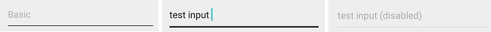
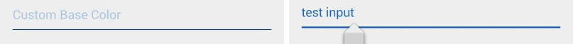
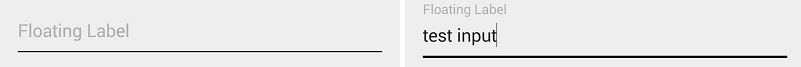
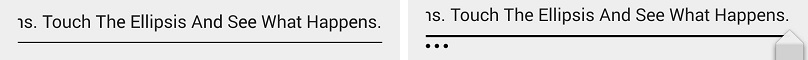
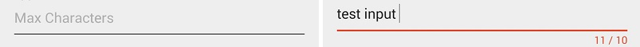
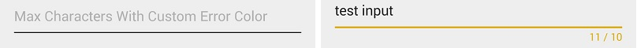

MaterialEditText
================


AppCompat v21 makes it easy to use Material Design EditText in our apps, but it's so limited. If you've tried that, you know what I mean. So I wrote MaterialEditText, the EditText in Material Design, with more features that [Google Material Design Spec](http://www.google.com/design/spec/components/text-fields.html) has introduced.

## Features
1. Basic.

  
  
2. Custom Base Color
  
  
  
3. Custom Primary Color
  
  
  
4. Floating Label
  
  normal:
  
  
  
  highlight:
  
  
  
5. Single Line Ellipsis
  
  
  
6. Max Characters
  
  default error color:
  
  
  
  custom error color:
  
  

## Sample

[MaterialEditText-1.0.0-sample.apk](https://github.com/rengwuxian/MaterialEditText/releases/download/1.0.0/MaterialEditText-1.0.0-sample.apk)
  
## Download

Eclipse:
[MaterialEditText-1.0.0.aar](https://github.com/rengwuxian/MaterialEditText/releases/download/1.0.0/MaterialEditText-1.0.0.aar)

gradle:

```groovy
compile 'com.rengwuxian.materialedittext:library:1.0.0'
```

Maven:
```xml
<dependency>
  <groupId>com.rengwuxian.materialedittext</groupId>
  <artifactId>library</artifactId>
  <version>1.0.0</version>
  <type>aar</type>
</dependency>
```

## Usage

See on [Wiki Page](https://github.com/rengwuxian/MaterialEditText/wiki/Wiki-for-Material-EditText)

## License

    Copyright 2014 rengwuxian

    Licensed under the Apache License, Version 2.0 (the "License");
    you may not use this file except in compliance with the License.
    You may obtain a copy of the License at

       http://www.apache.org/licenses/LICENSE-2.0

    Unless required by applicable law or agreed to in writing, software
    distributed under the License is distributed on an "AS IS" BASIS,
    WITHOUT WARRANTIES OR CONDITIONS OF ANY KIND, either express or implied.
    See the License for the specific language governing permissions and
    limitations under the License.
    
